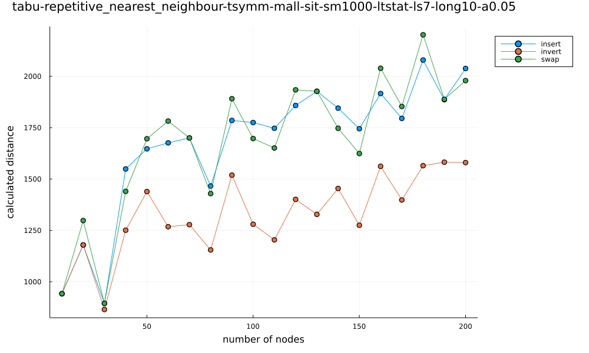
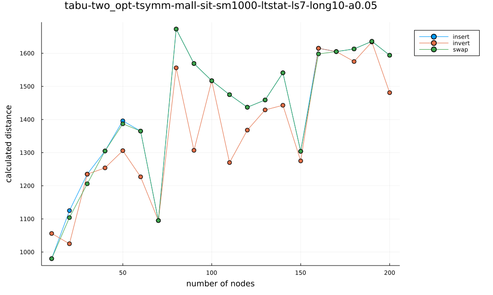
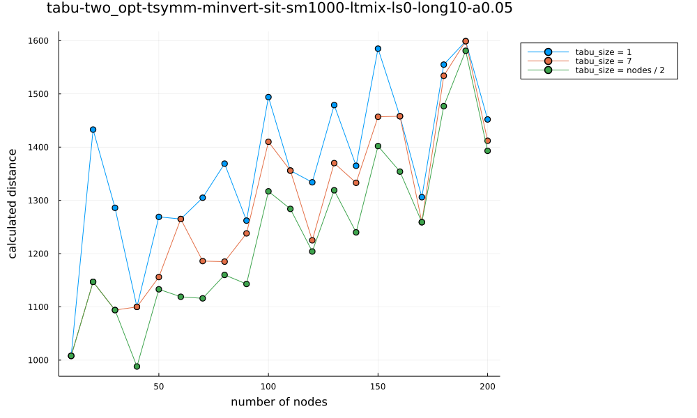
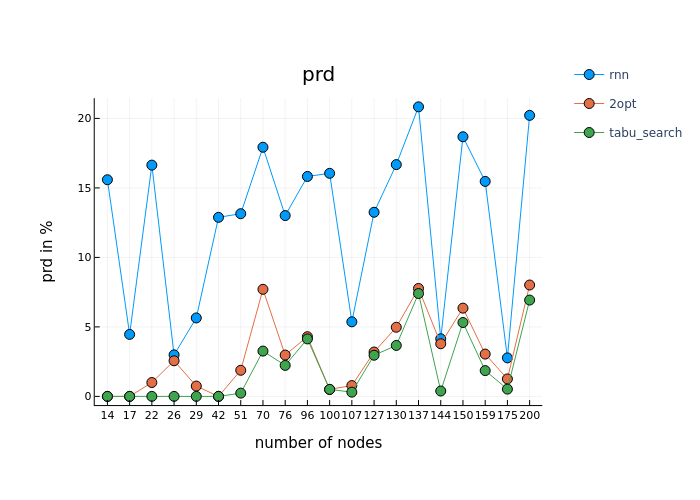

## Sprawozdanie [Etap 2](http://radoslaw.idzikowski.staff.iiar.pwr.wroc.pl/instruction/meta2.pdf)

#### Algorytmy metaheurystyczne

#### Grupa: czwartek 15:15

#### Autorzy: Joanna Kulig (261738), Lena Jasińska (261743)

#### Język: Julia

### Badania:

Badania przeprowadzałyśmy na wybranych przez nas instancjach z TSPLIB (tych samych, co dla etapu 1) oraz wygenerowancyh przez nas symetrycznych danych.

Wyniki można znaleźć:

- [wygenerowane dane](https://github.com/jasin-ska/Algorytmy-Metaheurystyczne/tree/master/2/jsons)
- [wykresy](https://github.com/jasin-ska/Algorytmy-Metaheurystyczne/tree/master/2/plots)

Wyniki naszych badań przedstawiamy poniżej na wykresach generowanych przez nas instancji - wiąże się to z przejrzystością wykresów. Jedynie wykres porównujący wszystkie algorytmy jest dla instancji z TSPLIB.

#### Typ ruchu jako parametr:

Możliwe rodzaje ruchu:

- `invert`: odwraca kawałek tablicy między indeksami `i` i `j`
- `insert`: wstawia węzeł z indeksu `i` na miejsce o indeksie `j`
- `swap`: zamienia miejscami węzły na indeksach `i` i `j`

####

Dla obu przypadków drogi początkowej - repetitive nearest neighbour i two opt można zauważyć znaczącą poprawę jeśli chodzi o końcowe wyniki dla ruchu typu `invert`, natomiast wyniki dla ruchów `insert` oraz `swap` są do siebie dość porównywalne.

#### Długość krótkoterminowej listy tabu a wynik tabu searcha:

Możliwe typy długości krótkoterminowej listy tabu:

- ustalona
- zależna od wielkości instancji

Z wykresu można wywnioskować, że wartość funckji celu jest znacznie lepsza dla sparametryzowanej długości krótkoterminowej listy tabu (zależnej od wielkości instancji) niż dla ustalonej długości tej listy dla każdego z problemów. Szczególnie widać różnicę przy mniejszych instancjach.

#### Wpływ wątków na wykonywanie programu:

Z badań wynika, że mając do czynienia z mniejszymi instancjami, użycie większej ilości wątków nie daje dużej poprawy jeśli chodzi o długość działania algorytmu. Jednakże przy większych problemach, odpowiednia liczba wątków widocznie poprawia czas wynonywania heurystyki.

#### Porównanie skuteczności tabu search do algorytmów zaimplementowanych w [etapie 1](http://radoslaw.idzikowski.staff.iiar.pwr.wroc.pl/instruction/meta1.pdf) na podstawie prd:

PRD określone jest wzorem: `(gen - opt) / opt * 100%`, gdzie:

- gen to najlepsza wartość funkcji celu dla danej heurystyki,
- opt to rozwiązanie optymalne dla zadanego problemu

Z badań wynika, że najlepszym algorytmem jest tabu search. Jego wyniki, choć podobne, są lepsze od drugiego two-opta. Jednakże należy wspomieć, że w wielu przypadkach heurystyka tabu search znalazła optymalne rozwiązanie dla danej instancji.

Z powodu małej widoczności, nie umieściłyśmy w sprawozdaniu wyników uwzględniających algorytm k-random, jednakże znajduje się on [tutaj](https://github.com/jasin-ska/Algorytmy-Metaheurystyczne/tree/master/2/plots/prd-tabu-krandom-rrn-twoopt.png).
