## Sprawozdanie [Etap 2](http://radoslaw.idzikowski.staff.iiar.pwr.wroc.pl/instruction/meta2.pdf)

#### Algorytmy metaheurystyczne

#### Grupa: czwartek 15:15

#### Autorzy: Joanna Kulig (261738), Lena Jasińska (261743)

#### Język: Julia

### Badania:

Badania przeprowadzałyśmy na wybranych przez nas instancjach z TSPLIB (tych samych, co dla etapu 1) oraz wygenerowancyh przez nas symetrycznych danych.

Wyniki można znaleźć:

- [wygenerowane dane](https://github.com/jasin-ska/Algorytmy-Metaheurystyczne/tree/master/2/jsons)
- [wykresy](https://github.com/jasin-ska/Algorytmy-Metaheurystyczne/tree/master/2/plots)

Wyniki naszych badań przedstawiamy poniżej na wykresach generowanych przez nas instancji - wiąże się to z przejrzystością wykresów. Jedynie wykres porównujący wszystkie algorytmy jest dla instancji z TSPLIB.

#### Starting path a wynik tabu searcha::

Możliwe algorytmy generujące rozwiązanie startowe:

- `k-random`
- `repetitive nearest neighbour`
- `2-OPT`

####

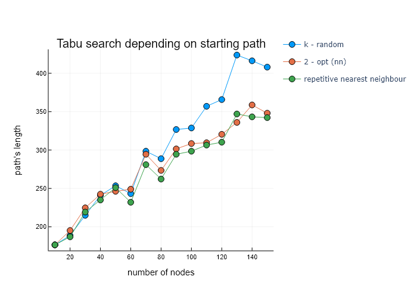

Wykres prezentuje znalezione przed tabu search rozwiązania w zależności od drogi początkowej. Możemy zauważyć, że start z rozwiązania gorszej jakości (jak k-random) skutkuje znalezieniem gorszych rozwiązań przez tabu search. Ponadto widzimy, że różnice między rozwiązaniami rosną wraz z rozmiarem problemu.

#### Starting path a stopień poprawy rozwiązania:

####

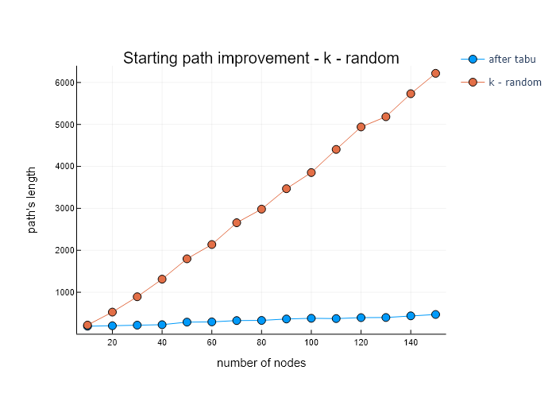

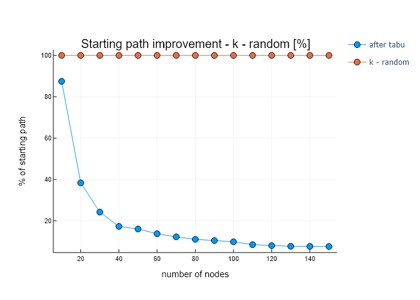

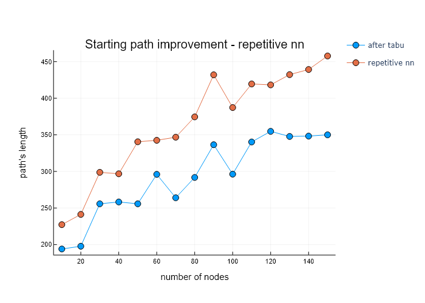

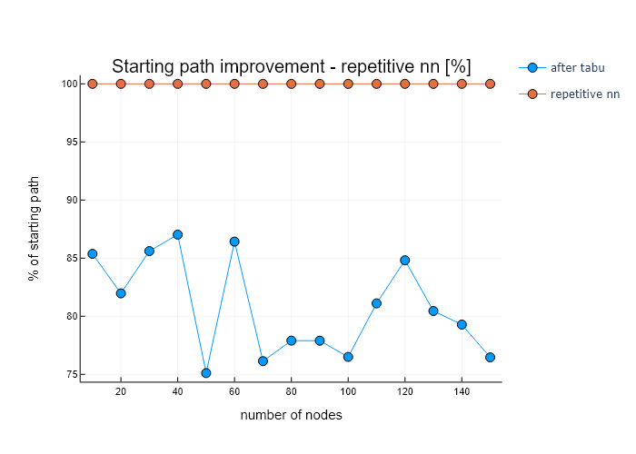

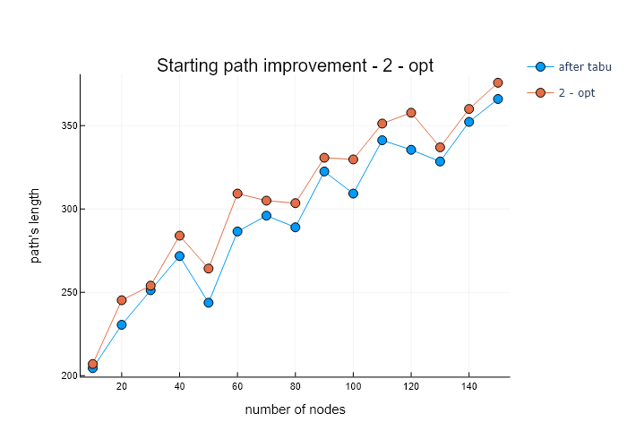

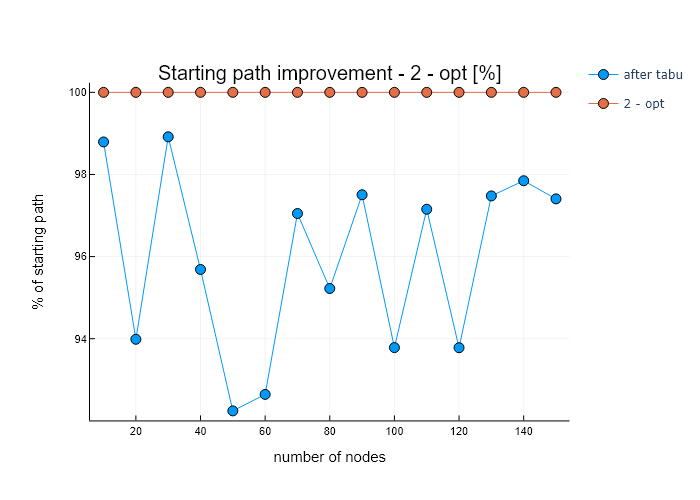

Dla każdego rodzaju drogi startowej przedstawiono porównanie długości drogi przed i po tabu search, a także zależność procentową między rozwiązaniem startowym a poprawionym. Można zauważyć, że bardziej zaawansowane algorytmy znajdujące rozwiązanie początkowe generują lepsze ścieżki, przez co następuje dla nich mniejsza poprawa.

#### Typ ruchu jako parametr:

Możliwe rodzaje ruchu:

- `invert`: odwraca kawałek tablicy między indeksami `i` i `j`
- `insert`: wstawia węzeł z indeksu `i` na miejsce o indeksie `j`
- `swap`: zamienia miejscami węzły na indeksach `i` i `j`

####

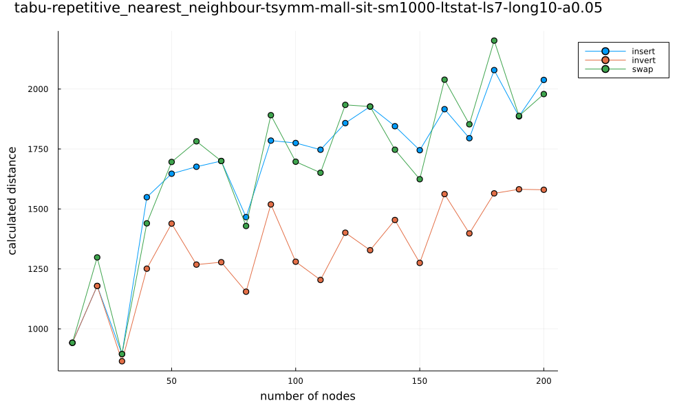

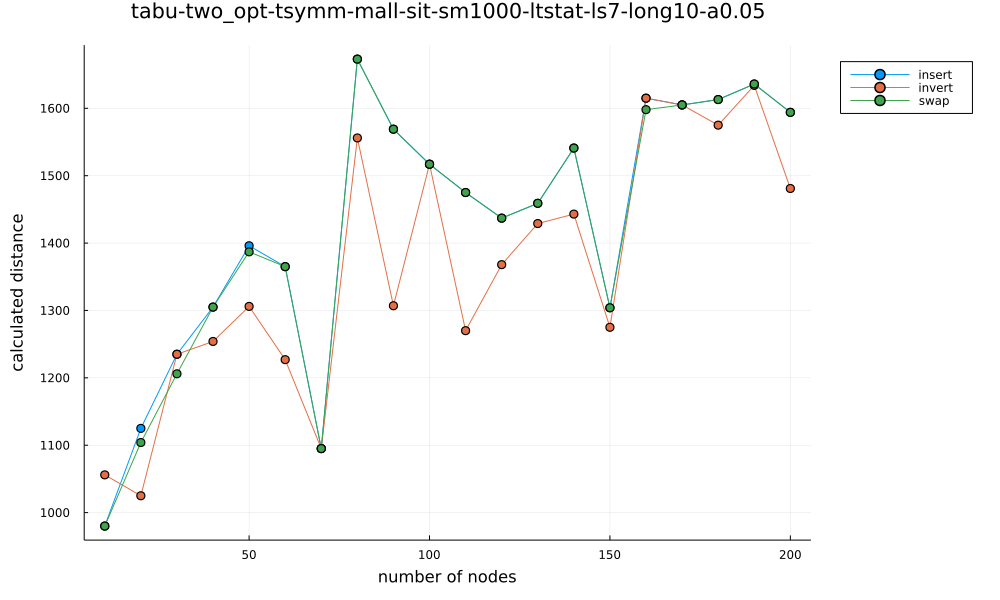

Dla obu przypadków drogi początkowej - repetitive nearest neighbour i two opt można zauważyć znaczącą poprawę jeśli chodzi o końcowe wyniki dla ruchu typu `invert`, natomiast wyniki dla ruchów `insert` oraz `swap` są do siebie dość porównywalne.

#### Długość krótkoterminowej listy tabu a wynik tabu searcha:

Możliwe typy długości krótkoterminowej listy tabu:

- ustalona
- zależna od wielkości instancji

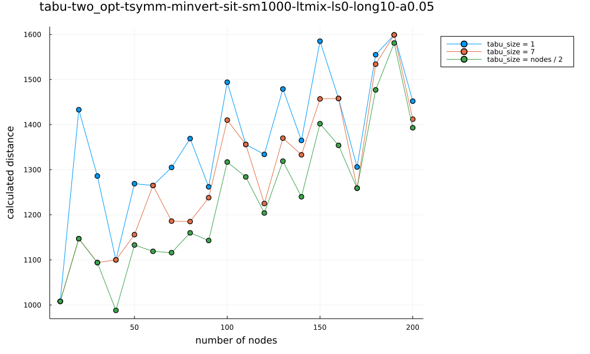

Z wykresu można wywnioskować, że wartość funckji celu jest znacznie lepsza dla sparametryzowanej długości krótkoterminowej listy tabu (zależnej od wielkości instancji) niż dla ustalonej długości tej listy dla każdego z problemów. Szczególnie widać różnicę przy mniejszych instancjach.

#### Długość pamięci długoterminowej a wynik tabu searcha:

Możliwe typy długości:

- ustalona
- zależna od wielkości instancji

Wykres obrazuje wynik zazstosowania pamięci długoterminowej. Rozwiązania bez pamięci długoterminowej (size = 0) są zdecydowanie najgorsze. Nieznacznie lepsze od stałych wartości wydaje się uzależnienie wielkości pamięci długoterminowej od rozmiaru problemu.

#### Liczba iteracji bez poprawy jako kryterium stopu:

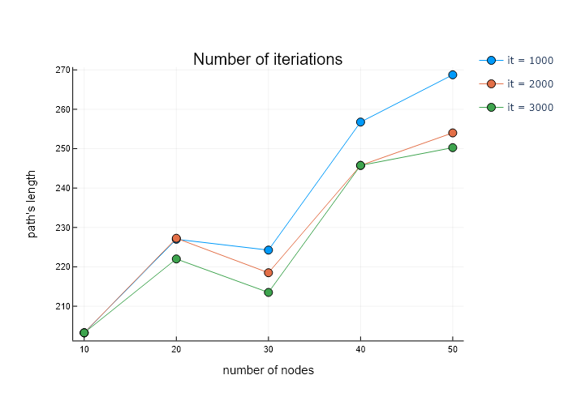

Wykres prezentuje, w jaki sposób zwiększenie dopuszczalnej liczby iteracji bez poprawy wpływa na znalezione rozwiązania. Zgodnie z intuicją, zwiększenie liczby iteracji pozwala na znalezienie lepszych rozwiązań.

#### Wpływ wątków na wykonywanie programu:

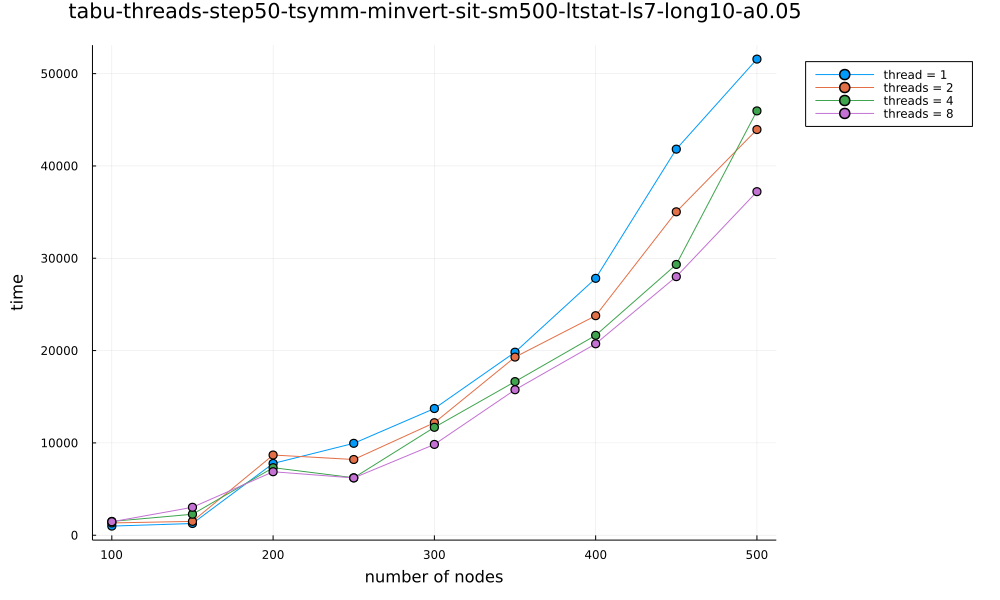

Z badań wynika, że mając do czynienia z mniejszymi instancjami, użycie większej ilości wątków nie daje dużej poprawy jeśli chodzi o długość działania algorytmu. Jednakże przy większych problemach, odpowiednia liczba wątków widocznie poprawia czas wynonywania heurystyki.

#### Porównanie skuteczności tabu search do algorytmów zaimplementowanych w [etapie 1](http://radoslaw.idzikowski.staff.iiar.pwr.wroc.pl/instruction/meta1.pdf) na podstawie prd:

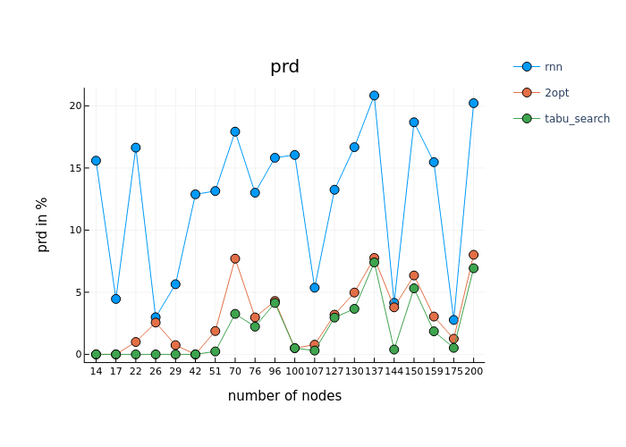

PRD określone jest wzorem: `(gen - opt) / opt * 100%`, gdzie:

- gen to najlepsza wartość funkcji celu dla danej heurystyki,
- opt to rozwiązanie optymalne dla zadanego problemu

Z badań wynika, że najlepszym algorytmem jest tabu search. Jego wyniki, choć podobne, są lepsze od drugiego two-opta. Jednakże należy wspomieć, że w wielu przypadkach heurystyka tabu search znalazła optymalne rozwiązanie dla danej instancji.

Z powodu małej widoczności, nie umieściłyśmy w sprawozdaniu wyników uwzględniających algorytm k-random, jednakże znajduje się on [tutaj](https://github.com/jasin-ska/Algorytmy-Metaheurystyczne/tree/master/2/plots/prd-tabu-krandom-rrn-twoopt.png).
