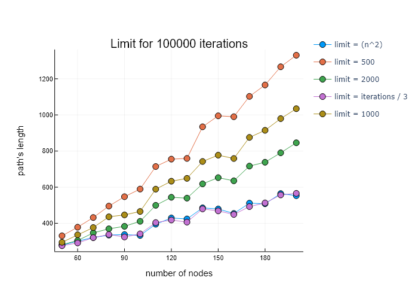
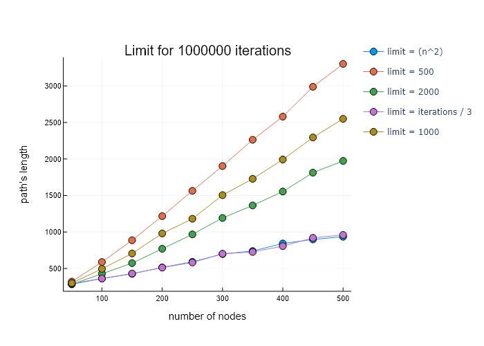
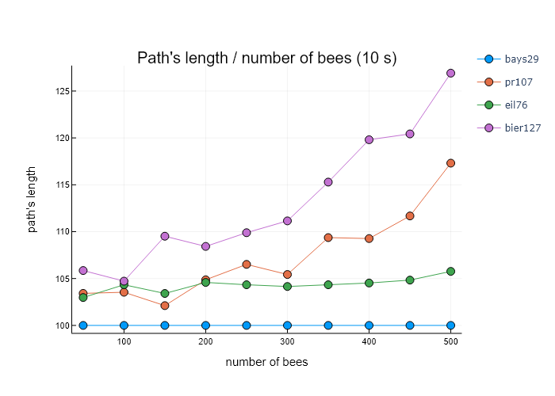
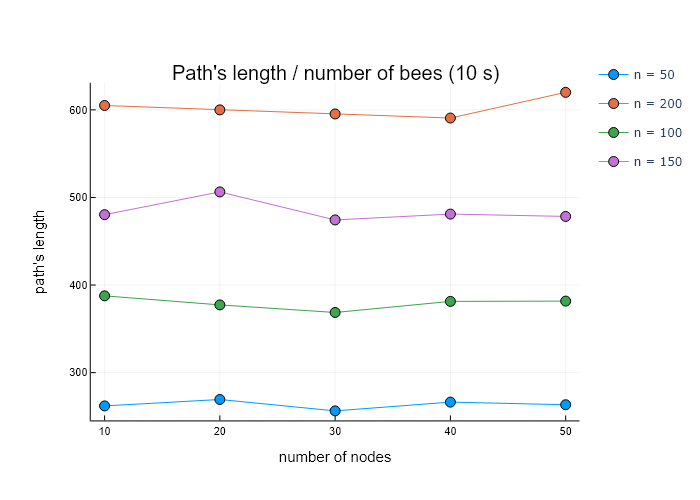
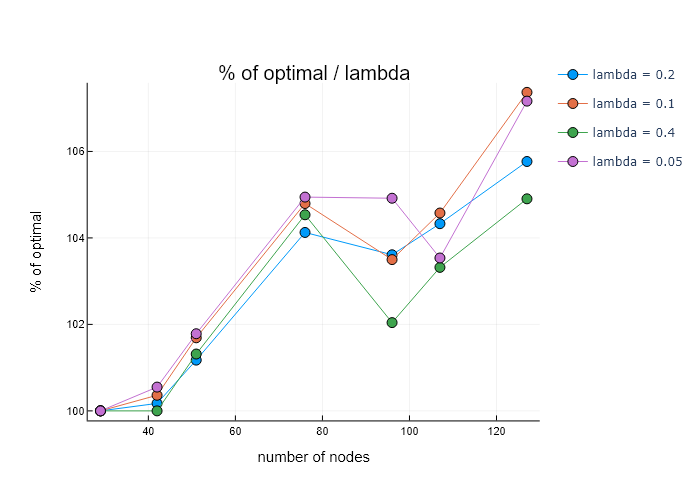
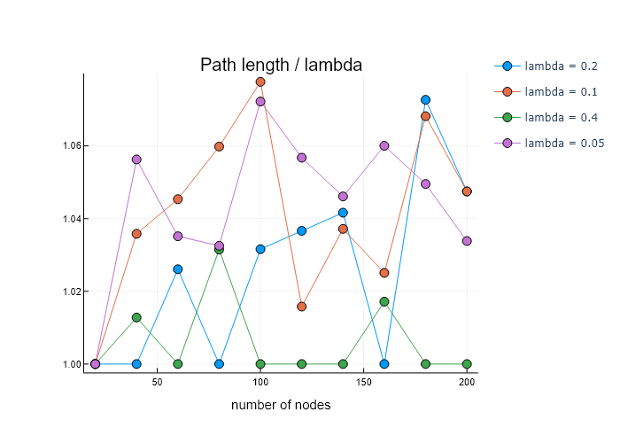
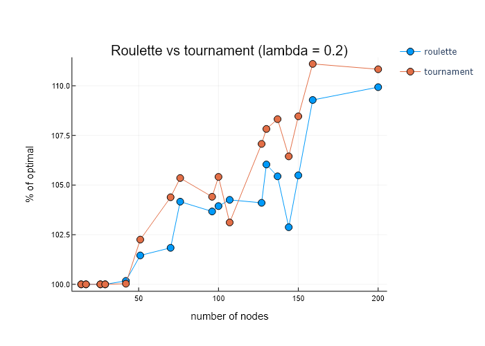
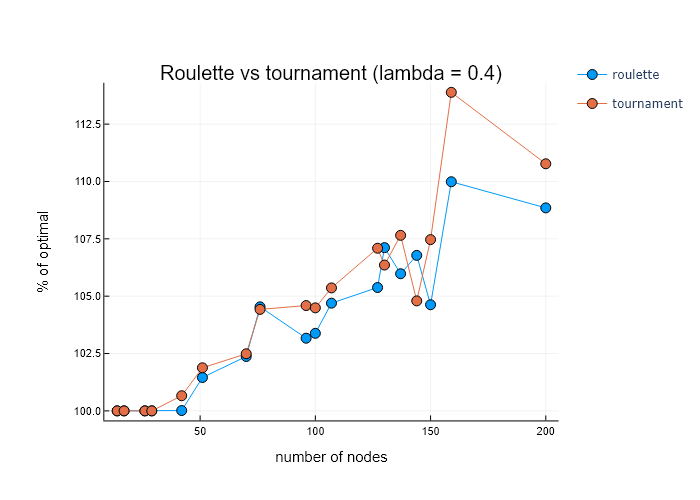

## Sprawozdanie [Etap 3](http://radoslaw.idzikowski.staff.iiar.pwr.wroc.pl/instruction/meta3.pdf)

#### Algorytmy metaheurystyczne

#### Grupa: czwartek 15:15

#### Autorzy: Lena Jasińska (261740), Joanna Kulig (261738)

#### Język: Julia

### Badania:

Badania przeprowadzałyśmy na wybranych przez nas instancjach z TSPLIB (tych samych, co dla poprzednich etapów) oraz wygenerowancyh przez nas symetrycznych danych.

Wyniki można znaleźć:

- [wykresy](https://github.com/jasin-ska/Algorytmy-Metaheurystyczne/tree/master/3/plots)

Wyniki naszych badań przedstawiamy poniżej na wykresach.

---

#### Wyznaczanie parametru limit:

Parametr `limit` określa, po ilu iteracjach bez poprawy odrzucamy rozwiązanie. Jego odpowiednie dobranie ma duży wpływ na jakość znalezionego rozwiązania.

###

Z badań wynika, że najlepsze rezultaty osiągniemy uzależniając wartość parametru `limit` od wielkości problemu `n` lub całkowitej liczby iteracji algorytmu (podanej jako warunek stopu). Uzależnienie `limit` od wielkości problemu `n` jest zgodne z intuicją - im większy problem, tym większe sąsiedztwo każdego rozwiązania, tym więcej razy powinniśmy próbować poprawić dane rozwiązanie. W kolejnych badaniach jako wartość `limit` zostało przyjęte n^2.

---

#### Wyznaczanie liczby pszczół:

Im więcej pszczół, tym więcej rozwiązań jednocześnie możemy badać. Im mniej pszczół, tym krótszy czas pojedynczej iteracji, dzięki czemu wykona się ich więcej, co także pozwoli przejrzeć więcej rozwiązań. Poniższe badanie ma na celu wyznaczenie liczby pszczół dającej lepsze wyniki.

####

Jako kryterium stopu zostało przyjęte 10 sekund działania algorytmu. Na osi x mamy liczbę pszczół od 50 do 500, badana była długość znalezionych ścieżek dla problemów o rozmiarach 29, 76, 107, 127 (z TSP). Możemy zauważyć, że lepsze wyniki uzyskujemy przy mniejszej liczbie pszczół. Jest to szczególnie widoczne dla większych instancji problemów. Drugi z wykresów pokazuje małą różnicę między liczbą pszczół w zakresie 10-50. W kolejnych badaniach liczba pszczół została przyjęta jako 50.

---

#### Metody selekcji:

Możliwe rodzaje selekcji:

- `roulette`: losuje rozwiązanie z prawdopodobieństwem zależnym od wartości funkcji celu - im mniejsza długość ścieżki, tym większa szansa na jej wylosowanie
- `tournament`: losuje (`lambda` * `liczba pszczół`) rozwiązań, zwraca najlepsze z nich (o minimalnej długości ścieżki)

#### Turniej - wyznaczanie parametru lambda

W przypadku metody selekcji opartej na turnieju ważnym krokiem jest dobranie odpowiedniej wartości parametru `lambda`. W tym celu zostało przeprowadzone badanie uzależniające jakość znalezionego rozwiązania względem rozwiązania optymalnego od wartości parametru `lambda`. Drugi wykres dzielił wynik każdego punktu przez minimum w tym punkcie - dzięki temu wyraźnie widać najlepsze w danym punkcie rozwiązanie. (liczba pszczół = 50)

Z badań wynika, że najlepsza wartość dla parametru `lambda` jest w okolicy 0.2-0.4. Jest to związane zapewne z małą liczbą pszczół.

#### Ruletka vs turniej

Poniższe badanie porównuje jakość znalezionych rozwiązań w zależności od wybranej metody selekcji.

Dla obu badanych wartości parametru `lambda` selekcja z wykorzystaniem ruletki okazała się lepsza od wykorzystania turnieju.

#### Tu jeszcze będzie:

- Czas a długość ścieżki
- TABU a ABC
- Wyznaczanie najlepszego ratio ruchów

#### Wpływ wątków na wykonywanie programu:

Wykres i wnioski

#### Porównanie skuteczności ABC do algorytmów zaimplementowanych w [etapie 1](http://radoslaw.idzikowski.staff.iiar.pwr.wroc.pl/instruction/meta1.pdf) i [etapie 2](http://radoslaw.idzikowski.staff.iiar.pwr.wroc.pl/instruction/meta2.pdf) na podstawie prd:

Tu będzie wykres

PRD określone jest wzorem: `(gen - opt) / opt * 100%`, gdzie:

- gen to najlepsza wartość funkcji celu dla danej heurystyki,
- opt to rozwiązanie optymalne dla zadanego problemu

Tu będą wnioski z wykresu

Z powodu małej widoczności, nie umieściłyśmy w sprawozdaniu wyników uwzględniających algorytm k-random, jednakże znajduje się on [tutaj](https://github.com/jasin-ska/Algorytmy-Metaheurystyczne/tree/master/2/plots/prd-tabu-krandom-rrn-twoopt.png).
